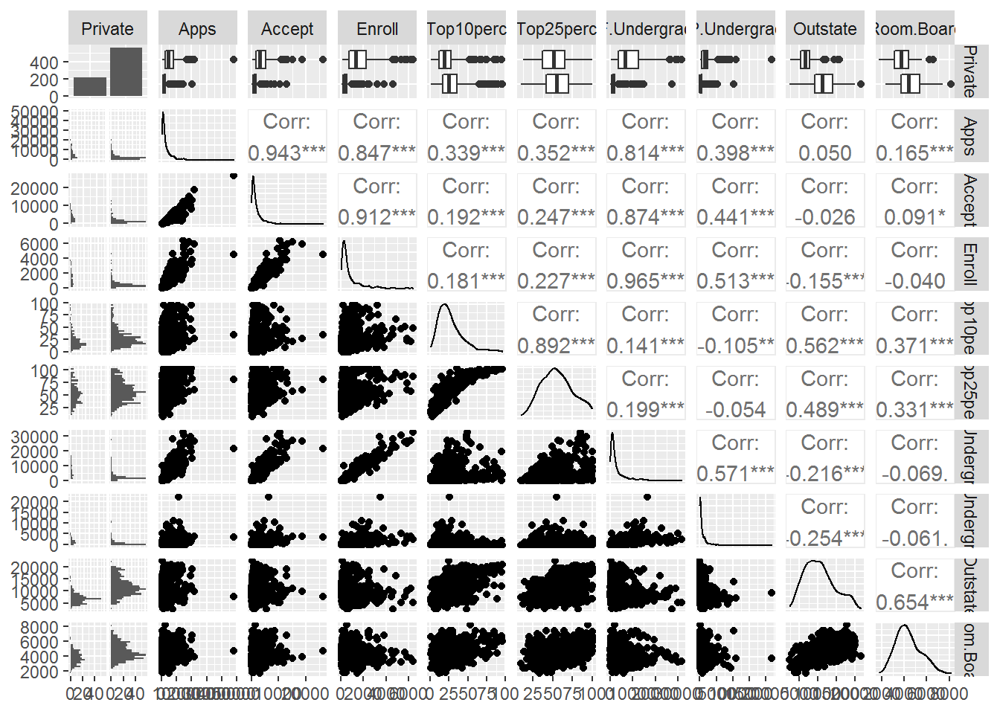
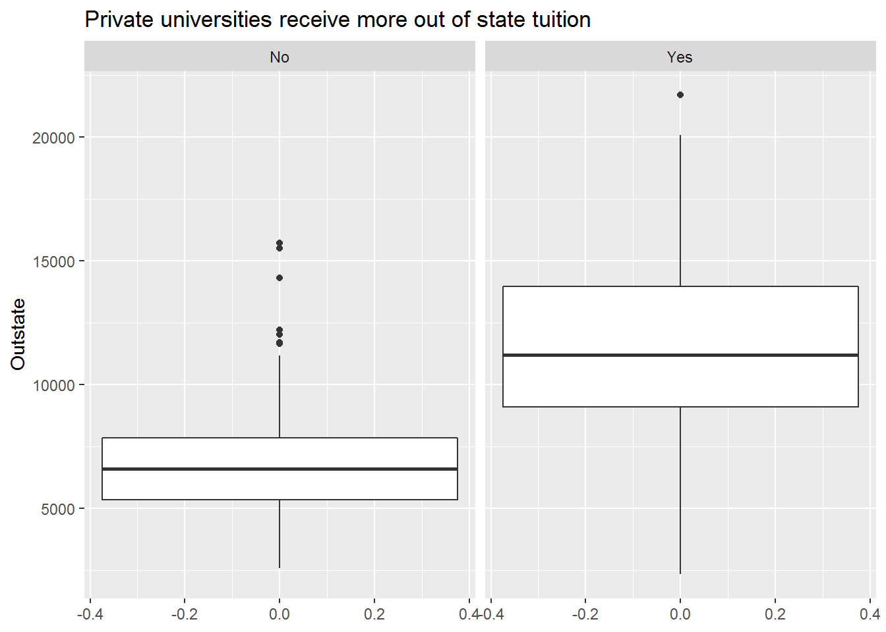
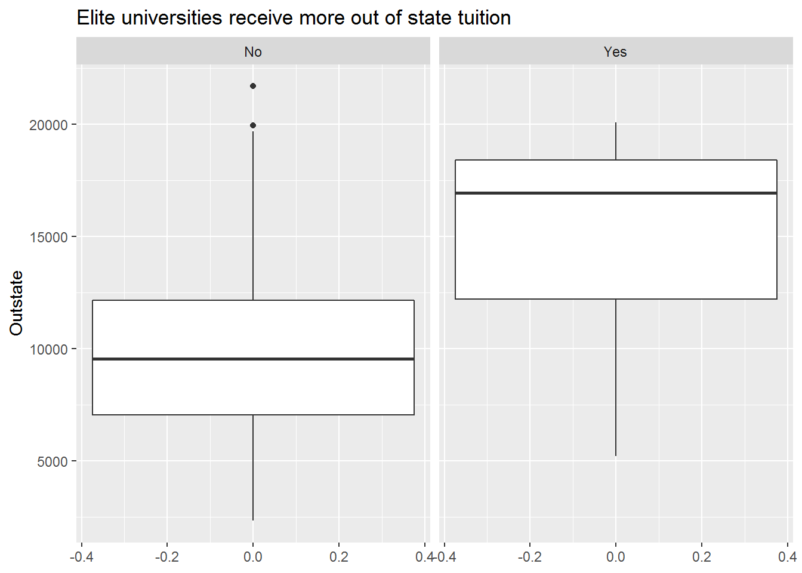

# Statistical Learning {#chapter-2}

Chapter 2 formalizes the concept of statistical learning by introducing the general statistical model used for modelling the relationship between $Y$ and $X = (X_1, X_2, \dots, X_p)$, which can be written as

$$
Y = f(X) + \epsilon.
(\#eq:gsm)
$$

Here:

-   $Y$ represents the response variable in our data set
-   $X$ represents the set of variables in our data set
-   $X_p$ represents the $p$th variable in our data set
-   $f(\dots)$ represents a fixed but unknown function of its input(s)
-   $\epsilon$ represents a random error term which is independent of $X$ and has mean zero

The goal of statistical learning is to estimate $f$. There are two main reasons for estimating $f$: *prediction* and *inference*. Depending on whether our ultimate goal is prediction, inference, or some combination of the two, different methods for estimating $f$ may be appropriate. In general, there is a trade-off between prediction accuracy and model interpretability. Models that make more accurate predictions tend to be less interpretable, and models that are more interpretable tend to make less accurate predictions (although this is not always the case, due to the potential for *overfitting* in highly flexible models).

The methods we use to estimate $f$ can be characterized as either *parametric* or *non-parametric*. Parametric methods involve a two-step model-based approach: First we make an assumption about the functional form of $f$ (e.g., we could assume $f$ is linear). Second we *fit* (train) the model to our training data in order to estimate the parameters. Non-parametric methods do not make any assumptions about the functional form of $f$. Instead they try to find an estimate of $f$ that gets close to the data points without being too rough or wiggly.

## Prediction

Because the error term $\epsilon$ averages to zero, the general statistical model for predicting $Y$ from $X = (X_1, X_2, \dots, X_p)$ can be written as

$$
\hat Y = \hat f(X).
(\#eq:gsm-p)
$$

Here:

-   $\hat Y$ represents the resulting prediction for $Y$
-   $\hat f$ represents our estimate for $f$

When our goal is only to predict, we do not typically need to concern ourselves with the exact form of $\hat f$ provided that it accurately predicts $Y$. The accuracy of $\hat Y$ as a prediction for $Y$ depends on two sources of error: *reducible error* and *irreducible error*. The error in our model attributable to $\hat f$ is *reducible* because we can potentially improve the accuracy of $\hat f$ for estimating $f$ by using a more appropriate statistical learning technique. However, the error in our model attributable to $\epsilon$ is *irreducible* because $Y$ is also a function of $\epsilon$, and $\epsilon$ is independent of $X$, so no matter how well we estimate $f$, the variability associated with $\epsilon$ will still be present in our model. This variability may come from unmeasured variables that are useful for predicting $Y$, or from unmeasurable variation. Irreducible error places an (often unknowable) upper bound on the accuracy of our prediction for $Y$.

## Inference

When our goal is to understand the relationship between $Y$ and $X = (X_1, X_2, \dots, X_p)$, we do need to concern ourselves with the exact form of $\hat f$. Here the form of $\hat f$ can be used to identify:

-   Which predictors are associated with the response
-   the direction (positive or negative) and form (simple or complex) of the relationship between the response and each predictor

## Assessing Model Accuracy

No one statistical learning approach performs better than all other approaches on all possible data sets. Because of this, care needs to be taken to choose which approach to use for any given data set to produce the best results. A number of important concepts arise when selecting a statistical learning approach for a specific data set:

-   Measuring the quality of fit
-   The bias-variance trade-off

### In the Regression Setting

In the regression setting, the most commonly used quality of fit measure for training data is the mean squared error $\mathit{MSE}$, given by

$$
\mathit{MSE}_{\mathrm{training}} = \frac 1 n \sum_{i = 1}^n (y_i - \hat f(x_i))^2,
(\#eq:mse-training)
$$

where $\hat f(x_i)$ represents the prediction that $\hat f$ gives for the $i$th observation. When predicted responses are very close to true responses the $\mathit{MSE}$ will be small; When predicted responses are very far from true responses the $\mathit{MSE}$ will be large. We generally do not really care about this value because accurately predicting data we have already seen is not particularly useful.

when our goal is to assess the accuracy of predictions when we apply our method to previously unseen *test data*, we can compute the mean squared error for test observations, given by

$$
\mathit{MSE}_{\mathrm{testing}} = \frac 1 n \sum_{i = 1}^n (y_0 - \hat f(x_0))^2,
(\#eq:mse-testing)
$$

where $(x_0, y_0)$ is a previously unseen test observation not used to train the statistical learning model. We want to choose the model that gives the lowest *test* $\mathit{MSE}$ by minimizing the distance between $\hat f(x_0)$ and $y_0$. When a test data set is available then we can simply evaluate Equation \@ref(eq:mse-testing) and choose the statistical learning model where $\mathit{MSE}$ is the smallest. When a test data set is not available then we can use *cross-validation*, which is a method for estimating test $\mathit{MSE}$ using the training data set.

The expected test $\mathit{MSE}$ for a given value $x_0$ can always be decomposed into the sum of three fundamental quantities: the *variance* of $\hat f(x_0)$, the squared *bias* of $\hat f(x_0)$, and the variance of the error term $\epsilon$, written as

$$
E \bigl(y_0 - \hat f(x_0) \bigr)^2 = \mathrm{Var}(\hat f(x_0)) +
                                     [\mathrm{Bias(\hat f(x_0))}]^2 +
                                     \mathrm{Var}(\epsilon),
(\#eq:expected-test-mse)
$$

where the notation $E \bigl(y_0 - \hat f(x_0) \bigr)^2$ defines the expected test $\mathit{MSE}$ at $x_0$. The overall expected test $\mathit{MSE}$ is given by averaging $E \bigl(y_0 - \hat f(x_0) \bigr)^2$ over all possible values of $x_0$ in the test data set.

The variance of $\hat f$ refers to the amount by which $\hat f$ would change if we estimated it using a different training set. The bias of $\hat f$ refers to the error that is introduced by approximating a real-life problem with a much simpler model. In general, as models become more flexible, the variance will increase and the bias will decrease. The relative rate of change of the variance and bias determines whether the test $\mathit{MSE}$ increases or decreases. Because the variance and bias can change at different rates in different data sets, the challenge lies in finding a model for which both the variance and bias are lowest.

### In the Classification Setting

In the classification setting, the most commonly used quality of fit measure for training data is the *error rate*, given by

$$
\frac 1 n \sum_{i = 1}^n I(y_i \ne \hat y_i).
(\#eq:er-training)
$$

Here:

-   $\hat y_i$ is the predicted class label for the $i$th observation using $\hat f$
-   $I(y_i \ne \hat y_i)$ is an indicator variable that equals one if $y_i \ne \hat y_i$ (incorrectly classified) and zero if $y_i = \hat y_i$ (correctly classified)

The *test error rate* for a set of test observations $(x_0, y_0)$ is given by

$$
\frac 1 n \sum_{i = 1}^n I(y_0 \ne \hat y_0),
(\#eq:er-testing)
$$

where $\hat y_0$ is the predicted class label that results from applying the classifier to the test observation with predictor $x_0$.

The bias-variance trade-off is present in the classification setting too; when variance and bias are lowest then the test error rate will be at its smallest for a given data set.

## Exercises

### Prerequisites {.unnumbered}

To access the data sets and functions used to complete the Chapter 2 exercises, load the following packages.


```r
# library(ISLR2)
library(tidyverse)
library(skimr)
library(GGally)
```

### Conceptual {.unnumbered}

::: exercise
For each of parts (a) through (d), indicate whether we would generally expect the performance of a flexible statistical learning method to be better or worse than an inflexible method. Justify your answer.

(a) The sample size $n$ is extremely large, and the number of predictors $p$ is small.

*Answer*. Better. A flexible model will generally be able to better estimate the the true $f$ and avoid overfitting when we have an extremely large sample size and a small number of predictors. The only exception would be if the true $f$ is linear, then an inflexible model would generally perform better; however, most real world relationships are not linear, so the lower bias of a flexible model will generally lead to a better quality of fit.

(b) The number of predictors $p$ is extremely large, and the number of observations $n$ is small.

*Answer*. Worse. A flexible model will generally lead to overfitting of our training data when the number of predictors is large and the sample size is small. An inflexible model is less likely to lead to overfitting in this scenario, so it will generally do a better job of giving accurate predictions on new observations than the flexible but overfit model.

(c) The relationship between the predictors and response is highly non-linear.

*Answer*. Better. A flexible model will generally be able to fit a highly non-linear relationship better than an inflexible model because the relative rate of decrease in bias tends to be much greater than the relative increase in variance when $f$ is highly non-linear. The left and right plots in Figure 2.12 on Page 36 of the book demonstrate this nicely.

(d) The variance of the error terms, i.e. $\sigma^2 = \mathrm{Var}(\epsilon)$, is extremely high.

*Answer*. Worse. A flexible model will generally lead to overfitting of our training data when the variance of the error terms is extremely high. Because $Y$ is partly a function of $\epsilon$, when the variance of the error terms is extremely high then the variance of $Y$ will also be extremely high, mainly due to random error. A flexible model that tries to find patterns in this noise is more likely to pick up on patterns that are caused by random chance rather than true properties of the unknown function $f$. The bias of an inflexible model is preferable in this situation, as it will give more stable predictions in the long run, which is likely preferable to making the essentially random predictions a flexible model would give in these circumstances.
:::

::: exercise
Explain whether each scenario is a classification or regression problem, and indicate whether we are most interested in inference or prediction. Finally, provide $n$ and $p$.

(a) We collect a set of data on the top 500 firms in the US. For each firm we record profit, number of employees, industry, and the CEO salary. We are interested in understanding which factors affect CEO salary.

*Answer*. Regression, inference, $n = 500$, $p = 3$.

(b) We are considering launching a new product and wish to know whether it will be a *success* or *failure*. We collect data on 20 similar products that were previously launched. For each product we have recorded whether it was a success or failure, price charged for the product, marketing budget, competition price, and ten other variables.

*Answer*. Classification, prediction, $n = 20$, $p = 13$.

(c) We are interested in predicting the % change in the USD/Euro exchange rate in relation to the weekly changes in the world stock markets. Hence we collect weekly data for all of 2012. For each week we record the % change in the USD/Euro, the % change in the US market, the % change in the British market, and the % change in the German market.

*Answer*. Regression, prediction, $n = 52$, $p = 3$.
:::

::: exercise
We now revisit the bias-variance decomposition.

(a) Provide a sketch of a typical (squared) bias, variance, training error, test error, and Bayes (or irreducible) error curves, on a single plot, as we go from less flexible statistical learning methods towards more flexible approaches. The $x$-axis should represent the amount of flexibility in the method, and the $y$-axis should represent the values for each curve. There should be five curves. Make sure to label each one.

*Answer*.


(b) Explain why each of the five curves has the shape displayed in part (a).

*Answer*. The value of each measure in part (a) changes at different rates and in different directions as we go from less flexible statistical learning methods towards more flexible approaches. Broadly, this is why each curve has a different shape. Specifically:

-   Bias refers to the error that is introduced by approximating a real-life problem with a much simpler model. In general, bias will decrease as models become more flexible, because more flexibility will lead to better approximations of a real-life problem, reducing error.
-   Variance refers to the amount by which $\hat f$ would change if we estimated it using a different training set. In general, variance will increase as models become more flexible, because a more flexible model will pick up patterns in the training data better which may differ between training sets.
-   Training error refers to the quality of fit of the model to the training data. In general, training error will steadily increase as models become more flexible, because more flexibility will allow the model to closely follow the training data.
-   Test error refers to the quality of fit of the trained model to the test data. In general, test error will be U-shaped because of the bias-variance trade-off.
-   Irreducible error refers to random error that is independent of $X$. Because irreducible error is independent of $X$, it remains stable regardless of model flexibility.
:::

::: exercise
You will now think of some real-life applications for statistical learning.

(a) Describe three real-life applications in which *classification* might be useful. Describe the response, as well as the predictors. Is the goal of each application inference or prediction? Explain your answer.

*Answer*.

-   Predicting whether or not a customer is likely to purchase more if items are discounted on a web store. The predictor would be whether or not they are likely to purchase more items; the predictors would be purchase history of discounted and full price items, and purchase frequency. The goal would be prediction in order to determine whether to show discounts to a customer more or less frequently.

-   Understanding what demographic groups enjoy Star Trek. The response would again be whether or not someone is a Trekkie; the predictors would be various demographic variables such as age, gender identity, ethnicity, and so on. The goal would be inference about whether Star Trek appeals to specific groups or is enjoyable to a diverse audience.

-   Understanding what kind of people like raisin cookies. The response would be whether or not someone likes raisin cookies; the predictors would be levels of psychopathy and sadism. The goal would be inference about whether people who like raisin cookies are secretly evil.

(b) Describe three real-life applications in which *regression* might be useful. Describe the response, as well as the predictors. Is the goal of each application inference or prediction? Explain your answer.

*Answer*.

-   Predicting the temperature tomorrow where you live. The response would be temperature in degrees Celsius; the predictors would be average temperature where you live in the past seven days, the latitude, longitude, and altitude of where you live, and the month of the year. The goal would be prediction in order to decide what outfit you might wear tomorrow.

-   Understanding what aspects of a video game lead to people playing it longer. The response would be minutes spent playing a game; the predictors would be game genre, whether the game is an original or sequel, whether the game is singleplayer, multiplayer, or both, and the game developer. The goal would be inference to determine what makes a game engaging.

-   Predicting how long it would take for an injury to heal. The response would be time to heal; the predictors would be injury severity, age, and other indicators of physical health. The goal would be prediction in order to give patients an idea the time to recovery.

(c) Describe three real-life applications in which *cluster analysis* might be useful.

*Answer*.

-   Identifying whether brain activity is more similar within or between individuals. The predictor variable would a repeated measure of functional connectivity. The goal would be inference in order to see whether brain activity recordings cluster together by individual.

-   Identifying whether patients with depression can be classified into subgroups. The predictor variables would be responses on a depression inventory. The goal would be inference in order to understand whether the depression inventory measures multiple types of depression.

-   Identifying whether species in families of animals identified by biologists aligns with those species' genomes. The predictor variable would be species genome. The goal would be understanding whether clusters identified through observation align with clusters identified through genetics.
:::

::: exercise
What are the advantages and disadvantages of a very flexible (versus a less flexible) approach for regression or classification? Under what circumstances might a more flexible approach be preferred to a less flexible approach? When might a less flexible approach be preferred?

*Answer*. The advantage of a very flexible approach is less bias, so the model better approximates reality, and typically better prediction. The disadvantage is higher variance and the potential for overfitting. A more flexible model might be preferred if the goal of statistical learning is prediction. A less flexible approach might be preferred if the goal of statistical learning is inference, as simpler models tend to be easier to understand.
:::

::: exercise
Describe the differences between a parametric and a non-parametric statistical learning approach. What are the advantages of a parametric approach to regression or classification (as opposed to a non-parametric approach)? What are its disadvantages?

*Answer*. Parametric methods involve a two-step model-based approach: First we make an assumption about the functional form of $f$ (e.g., we could assume $f$ is linear). Second we *fit* (train) the model to our training data in order to estimate the parameters. The advantage of this is that it is easier to estimate a set of parameters than it is to fit an entirely arbitrary function $f$. The disadvantage is that the model we choose will usually not match the true unknown form of $f$, which can lead to poor estimates if we are too far from the true $f$.

Non-parametric methods do not make any assumptions about the functional form of $f$. Instead they try to find an estimate of $f$ that gets close to the data points without being too rough or wiggly. The advantage of this is that it becomes easier to accurately fit a wider range of possible shapes for $f$. However, the disadvantage of this is that doing so accurately requires a much larger number of observations since the problem of estimating $f$ to a small number of parameters.
:::

::: exercise
The table below provides a training data set containing six observations, three predictors, and one qualitative response variable.

| Obs. | $X_1$ | $X_2$ | $X_3$ | $Y$   |
|------|-------|-------|-------|-------|
| 1    | 0     | 3     | 0     | Red   |
| 2    | 2     | 0     | 0     | Red   |
| 3    | 0     | 1     | 3     | Red   |
| 4    | 0     | 1     | 2     | Green |
| 5    | -1    | 0     | 0     | Green |
| 6    | 1     | 1     | 1     | Red   |

Suppose we wish to use this data set to make a prediction for $Y$ when $X1 = X2 = X3 = 0$ using K-nearest neighbours.

(a) Compute the Euclidean distance between each observation and the test point, $X1 = X2 = X3 = 0$.

*Answer*.

The equation for Euclidean distance is given by

$$
d(p, q) = \sqrt{ \sum_{i = 1}^n (q_i - p_i)^2},
(\#eq:euclidean-distance)
$$

where $d(p, q)$ represents the distance between points $p$ and $q$ in $n$ dimensional Euclidean space, and $q_i$ and $p_i$ represent Euclidean vectors, starting from the origin of the $n$ dimensional Euclidean space.

This can be computed in R like so.


```r
euclidean_distance <- function(q, p) sqrt(sum((q - p)^2))

obs_test <- c( 0, 0, 0)

obs_train <- list(
  obs_01 = c( 0, 3, 0),
  obs_02 = c( 2, 0, 0),
  obs_03 = c( 0, 1, 3),
  obs_04 = c( 0, 1, 2),
  obs_05 = c(-1, 0, 0),
  obs_06 = c( 1, 1, 1)
)

lapply(obs_train, function(x) euclidean_distance(obs_test, x))
#> $obs_01
#> [1] 3
#> 
#> $obs_02
#> [1] 2
#> 
#> $obs_03
#> [1] 3.162278
#> 
#> $obs_04
#> [1] 2.236068
#> 
#> $obs_05
#> [1] 1
#> 
#> $obs_06
#> [1] 1.732051
```

(b) What is our prediction with $K = 1$? Why?

*Answer*. When $K = 1$ our prediction for the test point will be whatever training observation is closest to the test point. Observation 5 (Green) is closest so our prediction is that the test point is Green.

(c) What is our prediction with $K = 3$? Why?

*Answer*. When $K = 3$ our prediction for the test point is given by the class with highest estimated probability based on the three points in the training data that are closest to the test point. Here observations 5 (Green), 6 (Red), and 2 (Red) are closest, which results in probabilities of 1/3 for the Green class and 2/3 for the Red class. So our prediction is that the test point is Red.

(d) If the Bayes decision boundary in this problem is highly non-linear, then would we expect the best value for $K$ to be large or small? Why?

*Answer*. We would expect a smaller value of K to give the best predictions. But not too small. When $K = 1$ the KNN decision boundary will be overly flexible, while with a large value of $K$ it will not be sufficiently flexible.
:::

### Applied {.unnumbered}

::: exercise
This exercise relates to the `ISLR2::College` data set. It contains a number of
variables for 777 different universities and colleges in the US. The help page `?ISLR2::College` for the data set contains a description of the data set and the 18 variables it measures.

(a) Load the `ISLR2::College` data set into R.


```r
# Make sure to preserve the row names with college names in them because they
# might be useful later
college <- as_tibble(ISLR2::College, rownames = NA)
str(college)
#> tibble [777 x 18] (S3: tbl_df/tbl/data.frame)
#>  $ Private    : Factor w/ 2 levels "No","Yes": 2 2 2 2 2 2 2 2 2 2 ...
#>  $ Apps       : num [1:777] 1660 2186 1428 417 193 ...
#>  $ Accept     : num [1:777] 1232 1924 1097 349 146 ...
#>  $ Enroll     : num [1:777] 721 512 336 137 55 158 103 489 227 172 ...
#>  $ Top10perc  : num [1:777] 23 16 22 60 16 38 17 37 30 21 ...
#>  $ Top25perc  : num [1:777] 52 29 50 89 44 62 45 68 63 44 ...
#>  $ F.Undergrad: num [1:777] 2885 2683 1036 510 249 ...
#>  $ P.Undergrad: num [1:777] 537 1227 99 63 869 ...
#>  $ Outstate   : num [1:777] 7440 12280 11250 12960 7560 ...
#>  $ Room.Board : num [1:777] 3300 6450 3750 5450 4120 ...
#>  $ Books      : num [1:777] 450 750 400 450 800 500 500 450 300 660 ...
#>  $ Personal   : num [1:777] 2200 1500 1165 875 1500 ...
#>  $ PhD        : num [1:777] 70 29 53 92 76 67 90 89 79 40 ...
#>  $ Terminal   : num [1:777] 78 30 66 97 72 73 93 100 84 41 ...
#>  $ S.F.Ratio  : num [1:777] 18.1 12.2 12.9 7.7 11.9 9.4 11.5 13.7 11.3 11.5 ...
#>  $ perc.alumni: num [1:777] 12 16 30 37 2 11 26 37 23 15 ...
#>  $ Expend     : num [1:777] 7041 10527 8735 19016 10922 ...
#>  $ Grad.Rate  : num [1:777] 60 56 54 59 15 55 63 73 80 52 ...
```

(c) Explore the `college` data.

i. Produce a numerical summary of the variables in the data set.


```r
skim(college)
```


Table: (\#tab:unnamed-chunk-3)Data summary

|                         |        |
|:------------------------|:-------|
|Name                     |college |
|Number of rows           |777     |
|Number of columns        |18      |
|_______________________  |        |
|Column type frequency:   |        |
|factor                   |1       |
|numeric                  |17      |
|________________________ |        |
|Group variables          |None    |


**Variable type: factor**

|skim_variable | n_missing| complete_rate|ordered | n_unique|top_counts        |
|:-------------|---------:|-------------:|:-------|--------:|:-----------------|
|Private       |         0|             1|FALSE   |        2|Yes: 565, No: 212 |


**Variable type: numeric**

|skim_variable | n_missing| complete_rate|     mean|      sd|     p0|    p25|    p50|     p75|    p100|hist                                     |
|:-------------|---------:|-------------:|--------:|-------:|------:|------:|------:|-------:|-------:|:----------------------------------------|
|Apps          |         0|             1|  3001.64| 3870.20|   81.0|  776.0| 1558.0|  3624.0| 48094.0|▇▁▁▁▁ |
|Accept        |         0|             1|  2018.80| 2451.11|   72.0|  604.0| 1110.0|  2424.0| 26330.0|▇▁▁▁▁ |
|Enroll        |         0|             1|   779.97|  929.18|   35.0|  242.0|  434.0|   902.0|  6392.0|▇▁▁▁▁ |
|Top10perc     |         0|             1|    27.56|   17.64|    1.0|   15.0|   23.0|    35.0|    96.0|▇▇▂▁▁ |
|Top25perc     |         0|             1|    55.80|   19.80|    9.0|   41.0|   54.0|    69.0|   100.0|▂▆▇▅▃ |
|F.Undergrad   |         0|             1|  3699.91| 4850.42|  139.0|  992.0| 1707.0|  4005.0| 31643.0|▇▁▁▁▁ |
|P.Undergrad   |         0|             1|   855.30| 1522.43|    1.0|   95.0|  353.0|   967.0| 21836.0|▇▁▁▁▁ |
|Outstate      |         0|             1| 10440.67| 4023.02| 2340.0| 7320.0| 9990.0| 12925.0| 21700.0|▃▇▆▂▂ |
|Room.Board    |         0|             1|  4357.53| 1096.70| 1780.0| 3597.0| 4200.0|  5050.0|  8124.0|▂▇▆▂▁ |
|Books         |         0|             1|   549.38|  165.11|   96.0|  470.0|  500.0|   600.0|  2340.0|▇▆▁▁▁ |
|Personal      |         0|             1|  1340.64|  677.07|  250.0|  850.0| 1200.0|  1700.0|  6800.0|▇▃▁▁▁ |
|PhD           |         0|             1|    72.66|   16.33|    8.0|   62.0|   75.0|    85.0|   103.0|▁▁▅▇▅ |
|Terminal      |         0|             1|    79.70|   14.72|   24.0|   71.0|   82.0|    92.0|   100.0|▁▁▃▆▇ |
|S.F.Ratio     |         0|             1|    14.09|    3.96|    2.5|   11.5|   13.6|    16.5|    39.8|▁▇▂▁▁ |
|perc.alumni   |         0|             1|    22.74|   12.39|    0.0|   13.0|   21.0|    31.0|    64.0|▅▇▆▂▁ |
|Expend        |         0|             1|  9660.17| 5221.77| 3186.0| 6751.0| 8377.0| 10830.0| 56233.0|▇▁▁▁▁ |
|Grad.Rate     |         0|             1|    65.46|   17.18|   10.0|   53.0|   65.0|    78.0|   118.0|▁▅▇▅▁ |

ii. Produce a scatterplot matrix of the first ten columns or variables of the data.


```r
college %>% 
  select(1:10) %>% 
  ggpairs()
#> `stat_bin()` using `bins = 30`. Pick better value with
#> `binwidth`.
#> `stat_bin()` using `bins = 30`. Pick better value with
#> `binwidth`.
#> `stat_bin()` using `bins = 30`. Pick better value with
#> `binwidth`.
#> `stat_bin()` using `bins = 30`. Pick better value with
#> `binwidth`.
#> `stat_bin()` using `bins = 30`. Pick better value with
#> `binwidth`.
#> `stat_bin()` using `bins = 30`. Pick better value with
#> `binwidth`.
#> `stat_bin()` using `bins = 30`. Pick better value with
#> `binwidth`.
#> `stat_bin()` using `bins = 30`. Pick better value with
#> `binwidth`.
#> `stat_bin()` using `bins = 30`. Pick better value with
#> `binwidth`.
```



iii. Produce side-by-side boxplots of `Outstate` versus `Private`.


```r
college %>% 
  ggplot(aes(y = Outstate)) +
    geom_boxplot() +
    facet_wrap(~Private) +
    labs(title = "Private universities receive more out of state tuition")
```




iv. Create a new qualitative variable, called `Elite`, by binning the `Top10perc` variable. We are going to divide universities into two groups based on whether or not the proportion of students coming from the top 10% of their high school classes exceeds 50%. See how many elite universities there are, then produce side-by-side boxplots of `Outstate` versus `Elite`.


```r
college %>% 
  mutate(Elite = if_else(Top10perc > 50, "Yes", "No") %>% as_factor()) %>% 
  ggplot(aes(y = Outstate)) +
    geom_boxplot() +
    facet_wrap(~Elite) +
    labs(title = "Elite universities receive more out of state tuition")
```



v. Produce some histograms with differing numbers of bins for a few of the quantitative variables.
    
vi. Continue exploring the data, and provide a brief summary of what you discover.
:::
