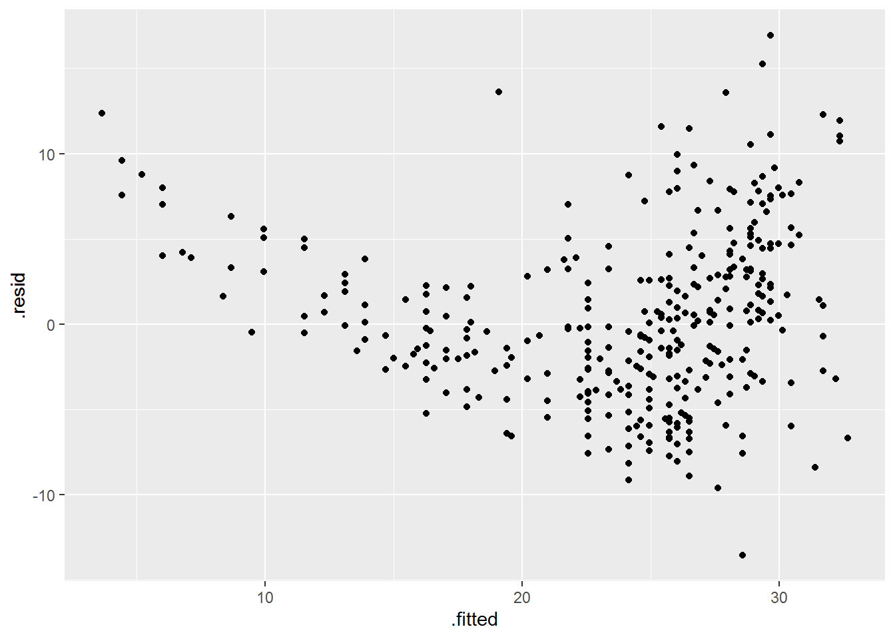
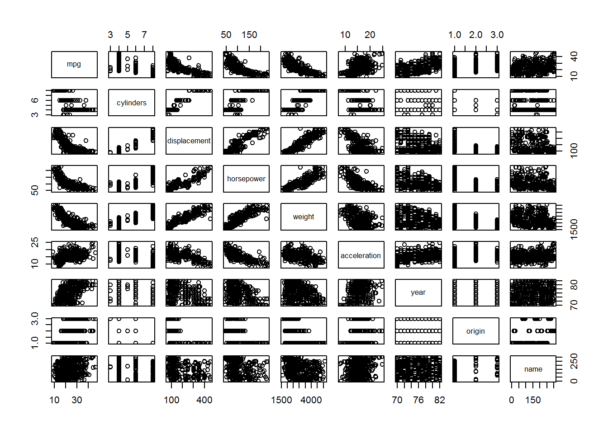
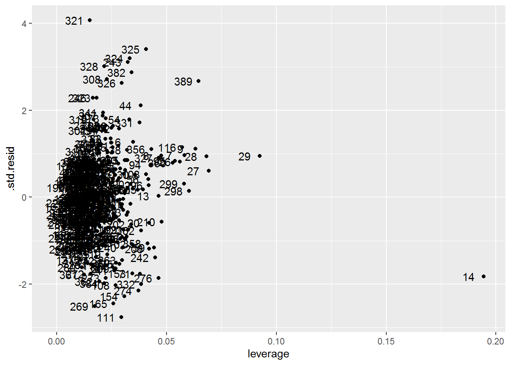

# Linear Regression {#chapter-3}

Chapter 3 is about (ordinary least squares and polynomial) linear regression, a parametric supervised statistical learning method. Many of the more advanced statistical learning approaches are generalizations or extensions of linear regression, so having a good grasp on linear regression is important for understanding later methods in the book.

It also discusses K-nearest neighbours regression (KNN regression), a non-parametric supervised statistical learning method.

## Exercises

### Prerequisites {.unnumbered}

To access the data sets and functions used to complete the Chapter 3 exercises, load the following packages.


```r
library(ISLR2)
library(tidyverse)
library(tidymodels)
# library(skimr)
# library(GGally)
# library(patchwork)
```

### Conceptual {.unnumbered}

::: exercise
Describe the null hypotheses to which the p-values given in Table 3.4 correspond. Explain what conclusions you can draw based on these p-values. Your explanation should be phrased in terms of sales, TV, radio, and newspaper, rather than in terms of the coefficients of the linear model.

| Term      | Coefficient | Std. Error | t-statistic | p-value  |
|-----------|-------------|------------|-------------|----------|
| intercept | 2.939       | 0.3119     | 9.420       | \< .001  |
| TV        | 0.046       | 0.0014     | 32.81       | \< .0001 |
| radio     | 0.189       | 0.0086     | 21.89       | \< .0001 |
| newspaper | -0.001      | 0.0059     | -0.18       | .8599    |

: Table 3.4

*Answer*.

The null hypotheses to which the p-values in Table 3.4 correspond is that the coefficient for each term is equal to zero, $\beta_i = 0$, which we use to test whether a term is associated with the response variable. We can use the p-values in the table to infer whether the coefficients are sufficiently far from zero that we can be confident they are non-zero, and thus associated with the response variable. 

Based on the p-values in Table 3.4, we can conclude that:

- A $1000 increase in the TV advertising budget is associated with an average increase in product sales by 46 units while holding the advertising budgets for radio and newspaper fixed.
- A $1000 increase in the radio advertising budget is associated with an average increase in product sales by 189 units while holding the advertising budgets for TV and newspaper fixed.
- A $1000 increase in the newspaper advertising budget is not associated with a change in product sales.

Data note: For the Advertising data sales are in thousands of units and advertising budgets in thousands of dollars.
:::

::: exercise
Carefully explain the differences between the KNN classifier and KNN regression methods.

*Answer*.

Given a value for $K$ and a test observation $x_0$, both the KNN classifier and KNN regression first identify the $K$ training observations that are closest to $x_0$, represented by $\mathcal N_0$. For the KNN classifier $x_0$ would be a discrete class, and for KNN regression $x_0$ would be a continuous value. The methods then diverge in what they do with $\mathcal N_0$.

The KNN classifier then estimates the conditional probability that the test observation $x_0$ belongs to class $j$ as the fraction of training observations in $\mathcal N_0$ whose response value $y_i$ equals $j$:

$$
\mathrm{Pr}(Y = j|X = x_0) =  \frac{1}{K} \sum_{i \in \mathcal N_0} I(y_i = j).
(\#eq:knn-classification)
$$

KNN regression, on the other hand, then estimates $f(x_0)$ using the average of all the training observations in $\mathcal N_0$:

$$
\hat f(x_0) = \frac{1}{K} \sum_{i \in {\mathcal N}_0} y_i.
(\#eq:knn-regression)
$$

As can be seen in Equations \@ref(eq:knn-classification) and \@ref(eq:knn-regression), there are two main differences between the KNN classifier and KNN regression methods:

- On the right side of the equation, the KNN classifier uses an indicator function $I(y_i = j)$ to determine whether a response value $y_i$ equals $j$ (if so then it equals 1, if not 0). These are summed to get the numerator of the conditional probability for each class (where the denominator is $K$). KNN regression, on the other hand, simply uses the response value $y_i$ as is, since it's a continuous value. These are also summed to get the numerator of the fraction (again with $K$ as the denominator), although it makes more sense to think of this as the average of all the training observations in $\mathcal N_0$. 
- On the left hand side of the equation, for the KNN classifier we estimate the conditional probability that a test observation $x_0$ belongs to a class $j$. We can then use this probability to assign $x_0$ to the class $j$ with the highest probability, if we so choose (although we don't have to, the probabilities are equally useful). For KNN regression we estimate the form of $f(x_0)$, which corresponds to our prediction point for our test observation $x_0$ since $\hat Y = \hat f(X)$.

Thus, the main difference between the two methods is that the KNN classifier method is used to predict what class an observation likely belongs to based on the classes of its $K$ nearest neighbours, whereas the KNN regression method is used to predict what value an observation will have on a response variable based on the response values of its $K$ nearest neighbours.
:::

::: exercise
Suppose we have a data set with five predictors, $X_1 =$ GPA, $X_2 =$ IQ, $X_3 =$ Level (1 for College and 0 for High School), $X_4 =$ Interaction between GPA and IQ, and $X_5 =$ Interaction between GPA and Level. The response is starting salary after graduation (in thousands of dollars). Suppose we use least squares to fit the model, and get $\hat \beta_0 = 50$, $\hat \beta_1 = 20$, $\hat \beta_2 = 0.07$, $\hat \beta_3 = 35$, $\hat \beta_4 = 0.01$, $\hat \beta_5 = −10$.

(a) Which answer is correct, and why?

i. For a fixed value of IQ and GPA, high school graduates earn more, on average, than college graduates.

ii. For a fixed value of IQ and GPA, college graduates earn more, on average, than high school graduates.

iii. For a fixed value of IQ and GPA, high school graduates earn more, on average, than college graduates provided that the GPA is high enough.

iv. For a fixed value of IQ and GPA, college graduates earn more, on average, than high school graduates provided that the GPA is high enough.

*Answer*. The fourth description is correct. The coefficient for Level is positive, so when it is included in the model (i.e., when Level is not zero) then predictions for starting salary will be higher; however, because the coefficient for the interaction between GPA and level is negative, this will only be true provided that college graduate GPA is high enough. 

(b) Predict the salary of a college graduate with IQ of 110 and a GPA of 4.0.

*Answer*.

The predicted salary for this college graduate is $137,100.

$$
\begin{align}
\hat y &= 50 + 20(4) + 0.07(110) + 35(1) + 0.01(4*110) - 10(4*1) \\
       &= 50 + 80 + 7.7 + 35 + 4.4 - 40 \\
       &= 137.1
\end{align}
$$

(c) True or false: Since the coefficient for the GPA/IQ interaction term is very small, there is very little evidence of an interaction effect. Justify your answer.

*Answer*. False. The size of the coefficient does not provide evidence for or against an interaction effect. We use the p-value associated with the coefficient to determine whether it is sufficiently far from zero that we can be confident it is non-zero, and thus associated with the response variable. If our estimates are precise enough we can find a small coefficient and be confident that it is non-zero. But we cannot make a decision about this based on the coefficient alone.
:::

::: exercise
I collect a set of data (n = 100 observations) containing a single predictor and a quantitative response. I then fit a linear regression model to the data, as well as a separate cubic regression, i.e. $Y = \beta_0 + \beta_1X + \beta_2X^2 + \beta_3X^3 + \epsilon$.

(a) Suppose that the true relationship between $X$ and $Y$ is linear,
i.e. $Y = \beta_0 + \beta_1X + \epsilon$. Consider the training residual sum of squares (RSS) for the linear regression, and also the training RSS for the cubic regression. Would we expect one to be lower than the other, would we expect them to be the same, or is there not enough information to tell? Justify your answer.

*Answer*.

Given that the true relationship between $X$ and $Y$ is linear we would expect the residual sum of squares to be lower for the linear regression than the cubic regression because:

- The least squares line minimizes RSS, and
- The linear regression matches the true form of $f(X)$, so
- The linear regression will fit better and thus have a smaller RSS.

(b) Answer (a) using test rather than training RSS.

*Answer*.

We would expect the same outcome with the test RSS as with the training RSS.

(c) Suppose that the true relationship between $X$ and $Y$ is not linear, but we don’t know how far it is from linear. Consider the training RSS for the linear regression, and also the training RSS for the cubic regression. Would we expect one to be lower than the other, would we expect them to be the same, or is there not enough information to tell? Justify your answer.

*Answer*.

Given that we don't know how far the true relationship between $X$ and $Y$ is from linear, it's hard to say for sure. If the true relationship is far from linear we would expect training RSS to be lower for the cubic regression than the linear regression because the bias-variance trade off would be poorer for the linear regression. We would expect the same if the true relationship was cubic because the cubic regression would match the true form of $f(X)$. However, if the true relationship was only slightly nonlinear then it's hard to say which would have lower training RSS, if any. There are likely situations where one or the other is better and where they are the same; although in general the cubic regression might overfit and thus have a lower RSS.

(d) Answer (c) using test rather than training RSS.

*Answer*.

Again, it's hard to say for sure. If the true relationship between $X$ and $Y$ is slightly nonlinear, we might expect the cubic regression to have overfit the training data, so the bias of the linear regression may lead to better predictions (and a lower RSS) in the test data. If the true relationship is cubic then the cubic regression would have a lower test RSS since it would match the true form of $f(X)$. If the true relationship is far from linear then we would expect the cubic regression to have lower RSS since it would have a better bias-variance trade off than the linear regression. 
:::

::: exercise
Consider the fitted values that result from performing linear regression without an intercept. In this setting, the $i$th fitted value takes the form

$$
\hat y_i = \hat \beta x_i,
$$

where

$$
\hat \beta = \bigg(\sum_{i = 1}^n x_i y_i \bigg) / \bigg(\sum_{i' = 1}^n x_{i'}^2 \bigg).
$$

Show that we can write 

$$
\hat y_i = \sum_{i' = 1}^n a_{i'} y_{i'}.
$$

What is $a_{i'}$?

*Answer*.

We can get to the solution by:

1. Plugging the expression for $\hat \beta$ into the formula for the $i$th fitted value.
2. Moving the constant $x_i$ into the numerator summation expression and changing the numerator summation dummy variable to $i'$, since $x_i$ is independent of $i'$.
3. Moving the summation for $i'$ out of the numerator.
4. Moving $y_{i'}$ out of the numerator.

Which looks like

$$
\begin{align}
\hat y_i &= x_i \hat \beta \\
         &= x_i \frac{\sum_{i = 1}^n x_i y_i}{\sum_{i' = 1}^n x_{i'}^2} \\
         &= \frac{\sum_{i' = 1}^n x_i x_{i'} y_{i'}}{\sum_{i'' = 1}^n x_{i''}^2} \\
         &= \sum_{i' = 1}^n \frac{x_i x_{i'} y_{i'}}{\sum_{i'' = 1}^n x_{i''}^2} \\
         &= \sum_{i' = 1}^n \frac{x_i x_{i'}}{\sum_{i'' = 1}^n x_{i''}^2} y_{i'} \\
         &= \sum_{i' = 1}^n a_{i'} y_{i'},
\end{align}
$$

where

$$
a_{i'} = \frac{x_i x_{i'}}{\sum_{i'' = 1}^n x_{i''}^2}.
$$

*Note*: We interpret this result by saying that the fitted values from linear regression are linear combinations of the response values.
:::

::: exercise
Using the least squares coefficient estimates equation, argue that in the case of simple linear regression, the least squares line always passes through the point $(\bar x, \bar y)$.

*Answer*.

The the least squares coefficient estimates are given by

$$
\begin{align}
\hat \beta_1 &= \frac{\sum_{i = 1}^n (x_i - \bar x)(y_i - \bar y)}
                     {\sum_{i = 1}^n (x_i - \bar x)^2}, \\
\hat \beta_0 &= \bar y - \hat \beta_1 \bar x.
\end{align}
$$

The least squares line is given by

$$
\hat y = \hat \beta_0 + \hat \beta_1 x.
$$

When $x = \bar x$ then $\hat y = \bar y$ on the least squares line. This can be demonstrated by substituting the least squares coefficient estimate equation for the intercept into the least squares line equation,

$$
\begin{align}
\hat y &= \hat \beta_0 + \hat \beta_1 \bar x \\
       &= \bar y - \hat \beta_1 \bar x + \hat \beta_1 \bar x \\
       &= \bar y.
\end{align}
$$

Since the least squares line passes through all values of $X$, it will always pass through the mean of the predictor $\bar x$, which exists somewhere between the smallest and largest values of $x$. As shown above, when $x = \bar x$ then $\hat y = \bar y$ on the least squares line, thus the least squares line always passes through the point $(\bar x, \bar y)$.
:::

::: exercise
It is claimed in the text that in the case of simple linear regression of $Y$ onto $X$, the $R^2$ statistic is equal to the square of the correlation between $X$ and $Y$. Prove that this is the case. For simplicity, you may assume that  $\bar x = \bar y = 0$.

*Answer*.

Skipping this one.
<!--
The $R^2$ statistic is given by

$$
R^2 = \frac{\mathrm{TSS} - \mathrm{RSS}}{\mathrm{TSS}}
    = 1 - \frac{\mathrm{RSS}}{\mathrm{TSS}},
$$

where $\mathrm{TSS} = \sum_{i = 1}^n (y_i - \bar y)^2$ and $\mathrm{RSS} = \sum_{i = 1}^n (y_i - \hat y_i)^2$. So

$$
R^2 = \frac{
  \sum_{i = 1}^n (y_i - \bar y)^2 - \sum_{i = 1}^n (y_i - \hat y_i)^2
}{
  \sum_{i = 1}^n (y_i - \bar y)^2
} = 1 - \frac{
  \sum_{i = 1}^n (y_i - \hat y_i)^2
}{
\sum_{i = 1}^n (y_i - \bar y)^2
}
$$

The correlation between $X$ and $Y$.

$$
\mathrm{Cor}(X,Y) = \frac{
  \sum_{i = 1}^n (x_i - \bar x)(y_i - \bar y)
}{
  \sqrt{\sum_{i = 1}^n (x_i - \bar x)^2} \sqrt{\sum_{i = 1}^n (y_i - \bar y)^2}
}
$$

Since $\bar x = \bar y = 0$ these can be simplified to

$$
R^2 = \frac{
  \sum_{i = 1}^n y_i^2 - \sum_{i = 1}^n (y_i - \hat y_i)^2
}{
  \sum_{i = 1}^n y_i^2
} = 1 - \frac{
  \sum_{i = 1}^n (y_i - \hat y_i)^2
}{
\sum_{i = 1}^n y_i^2
},
$$

and

$$
\mathrm{Cor}(X,Y) = \frac{
  \sum_{i = 1}^n x_i y_i
}{
  \sqrt{\sum_{i = 1}^n x_i^2 y_i^2}
}.
$$
RSS can also be simplified using the least squares coefficient estimates

$$
\begin{align}
\mathrm{RSS} &= \sum_{i = 1}^n (y_i - \hat y_i)^2 \\
  &= \sum_{i = 1}^n (y_i - \hat y_i)(y_i - \hat y_i) \\
  &= \sum_{i = 1}^n y_i^2 - 2 y_i \hat y_i + \hat y_i^2 \\
  &= \sum_{i = 1}^n y_i^2 - 2 y_i (\hat \beta_0 + \hat \beta_1 x_i) +
     (\hat \beta_0 + \hat \beta_1 x_i)^2 \\
  &= \sum_{i = 1}^n y_i^2 - 2 x_i y_i \hat \beta_1 + (\hat \beta_1 x_i)^2 \\
  &= \sum_{i = 1}^n y_i^2 - 2 x_i y_i
     \bigg(\frac{\sum_{i = 1}^n x_i y_i}{\sum_{i = 1}^n x_i^2}\bigg) +
     x_i^2 
     \bigg(\frac{\sum_{i = 1}^n x_i y_i}{\sum_{i = 1}^n x_i^2}\bigg)^2 \\
  &= \sum_{i = 1}^n y_i^2 - 2
     (\sum_{i = 1}^n x_i y_i)
     \bigg(\frac{\sum_{i = 1}^n x_i y_i}{\sum_{i = 1}^n x_i^2}\bigg) +
     x_i^2 
     \bigg(\frac{\sum_{i = 1}^n x_i y_i}{\sum_{i = 1}^n x_i^2}\bigg)^2 \\
     &= \sum_{i = 1}^n y_i^2 - 2
     \frac{(\sum_{i = 1}^n x_i y_i)^2}{\sum_{i = 1}^n x_i^2} +
     x_i^2 
     \bigg(\frac{\sum_{i = 1}^n x_i y_i}{\sum_{i = 1}^n x_i^2}\bigg)^2 \\
\end{align}
$$
-->
:::

### Applied {.unnumbered}

::: exercise
This question involves the use of simple linear regression on the `ISLR2::Auto`
data set.

(a) Use the `lm()` function to perform a simple linear regression with `mpg` as the response and `horsepower` as the predictor. Use the `summary()` function to print the results. Comment on the output.

*Answer*.


```r
auto_model <- lm(mpg ~ horsepower, data = Auto)
summary(auto_model)
#> 
#> Call:
#> lm(formula = mpg ~ horsepower, data = Auto)
#> 
#> Residuals:
#>      Min       1Q   Median       3Q      Max 
#> -13.5710  -3.2592  -0.3435   2.7630  16.9240 
#> 
#> Coefficients:
#>              Estimate Std. Error t value Pr(>|t|)    
#> (Intercept) 39.935861   0.717499   55.66   <2e-16 ***
#> horsepower  -0.157845   0.006446  -24.49   <2e-16 ***
#> ---
#> Signif. codes:  
#> 0 '***' 0.001 '**' 0.01 '*' 0.05 '.' 0.1 ' ' 1
#> 
#> Residual standard error: 4.906 on 390 degrees of freedom
#> Multiple R-squared:  0.6059,	Adjusted R-squared:  0.6049 
#> F-statistic: 599.7 on 1 and 390 DF,  p-value: < 2.2e-16
```

From the output above we can see that:

- There is a relationship between horsepower and mpg such that a one horsepower increase is associated with an average decrease in fuel economy of 0.157845 miles per gallon.
- Horsepower explains 60.59% of the variability in mpg.

If we make some predictions based on a few common horsepower values for different classes of vehicles (small car, average car, SUV) we can see that this model is misspecified.


```r
auto_model %>%
  predict(
    tibble(horsepower = c(98, 180, 300)),
    type = "response",
    interval = "confidence"
  )
#>         fit      lwr       upr
#> 1 24.467077 23.97308 24.961075
#> 2 11.523809 10.44983 12.597792
#> 3 -7.417559 -9.94281 -4.892308
```

When a vehicle has 300 horsepower our model predicts that it will have a fuel economy that falls somewhere between -9.94281 mpg and -4.892308 mpg. This implies that vehicles with high horsepower *produce* fuel during travel, rather than consuming it. It's a nonsense statistic that indicates this model is misspecified in a fairly severe way. Or perhaps that we have a data quality issue.

(b) Plot the response and the predictor. Display the least squares regression line using an reference line (abline).

*Answer*.


```r
ggplot(Auto, aes(x = horsepower, y = mpg)) +
  geom_point(alpha = 0.5) +
  geom_abline(
    slope = coef(auto_model)["horsepower"],
    intercept = coef(auto_model)["(Intercept)"],
    colour = "blue"
  ) +
  coord_cartesian(ylim = c(0, 50))
```


This plot gives some good evidence our model is misspecified. The relationship between horsepower and mpg is clearly nonlinear in our data. We also see that the range of horsepower in our data is limited in comparison to the amount of horsepower we might be interested in making predictions for.

(c) Produce diagnostic plots of the least squares regression fit. Comment on any problems you see with the fit.

*Answer*.


```r
auto_model %>% 
  augment() %>% 
  ggplot(aes(x = .fitted, y = .resid)) +
    geom_point()
```



The diagnostic plot clearly shows problems with the fit:

- The U-shape of the residuals gives a strong indication of nonlinearity (and we know there is nonlinearity in the data already).
- The non-constant variance of the residuals is a sign of heteroscedasticity.
- There are at least a couple outliers.
:::

::: exercise
This question involves the use of multiple linear regression on the `Auto` data set.

(a) Produce a scatterplot matrix which includes all of the variables
in the data set.

*Answer*.


```r
plot(Auto)
```



(b) Compute the matrix of correlations between the variables.

*Answer*.


```r
Auto %>% 
  select(-name) %>% 
  cor()
#>                     mpg  cylinders displacement horsepower
#> mpg           1.0000000 -0.7776175   -0.8051269 -0.7784268
#> cylinders    -0.7776175  1.0000000    0.9508233  0.8429834
#> displacement -0.8051269  0.9508233    1.0000000  0.8972570
#> horsepower   -0.7784268  0.8429834    0.8972570  1.0000000
#> weight       -0.8322442  0.8975273    0.9329944  0.8645377
#> acceleration  0.4233285 -0.5046834   -0.5438005 -0.6891955
#> year          0.5805410 -0.3456474   -0.3698552 -0.4163615
#> origin        0.5652088 -0.5689316   -0.6145351 -0.4551715
#>                  weight acceleration       year     origin
#> mpg          -0.8322442    0.4233285  0.5805410  0.5652088
#> cylinders     0.8975273   -0.5046834 -0.3456474 -0.5689316
#> displacement  0.9329944   -0.5438005 -0.3698552 -0.6145351
#> horsepower    0.8645377   -0.6891955 -0.4163615 -0.4551715
#> weight        1.0000000   -0.4168392 -0.3091199 -0.5850054
#> acceleration -0.4168392    1.0000000  0.2903161  0.2127458
#> year         -0.3091199    0.2903161  1.0000000  0.1815277
#> origin       -0.5850054    0.2127458  0.1815277  1.0000000
```

(c) Use the `lm()` function to perform a multiple linear regression with `mpg` as the response and all other variables except `name` and `origin` as the predictors. Use the summary() function to print the results. Comment on the output.

*Answer*.


```r
auto_model <- Auto %>% 
  mutate(
    across(origin, as_factor),
    across(
      origin,
      ~ fct_recode(.x, American = "1", European = "2", Japanese = "3")
    )
  ) %>% 
  lm(
    mpg ~ cylinders + displacement + horsepower + weight +
    acceleration + year + origin,
    data = .
  )
summary(auto_model)
#> 
#> Call:
#> lm(formula = mpg ~ cylinders + displacement + horsepower + weight + 
#>     acceleration + year + origin, data = .)
#> 
#> Residuals:
#>     Min      1Q  Median      3Q     Max 
#> -9.0095 -2.0785 -0.0982  1.9856 13.3608 
#> 
#> Coefficients:
#>                  Estimate Std. Error t value Pr(>|t|)    
#> (Intercept)    -1.795e+01  4.677e+00  -3.839 0.000145 ***
#> cylinders      -4.897e-01  3.212e-01  -1.524 0.128215    
#> displacement    2.398e-02  7.653e-03   3.133 0.001863 ** 
#> horsepower     -1.818e-02  1.371e-02  -1.326 0.185488    
#> weight         -6.710e-03  6.551e-04 -10.243  < 2e-16 ***
#> acceleration    7.910e-02  9.822e-02   0.805 0.421101    
#> year            7.770e-01  5.178e-02  15.005  < 2e-16 ***
#> originEuropean  2.630e+00  5.664e-01   4.643 4.72e-06 ***
#> originJapanese  2.853e+00  5.527e-01   5.162 3.93e-07 ***
#> ---
#> Signif. codes:  
#> 0 '***' 0.001 '**' 0.01 '*' 0.05 '.' 0.1 ' ' 1
#> 
#> Residual standard error: 3.307 on 383 degrees of freedom
#> Multiple R-squared:  0.8242,	Adjusted R-squared:  0.8205 
#> F-statistic: 224.5 on 8 and 383 DF,  p-value: < 2.2e-16
```

From the output above we can see that:

- The F-statistic indicates at least one predictor is non-zero.
- American vehicles have an average fuel economy of -17.9546021 miles per gallon when all other variables are 0. This is a nonsense statistic, as are holding most of the other variables at 0. Centring might help here.
- European vehicles have an average fuel economy 2.63 miles per gallon higher than American vehicles while holding all other variables fixed.
- Japanese vehicles have an average fuel economy 2.85 miles per gallon higher than American vehicles while holding all other variables fixed.
- A one year increase in vehicle model is associated with an average increase in fuel economy of 0.78 miles per gallon for American vehicles. So newer American vehicles are expected to have higher fuel economy.
- All other predictors except for cylinders, horsepower, and acceleration, have a statistically significant relationship with mpg.

(d) Produce diagnostic plots of the linear regression fit. Comment on any problems you see with the fit. Do the residual plots suggest any unusually large outliers? Does the leverage plot identify any observations with unusually high
leverage?

*Answer*.


```r
auto_model %>% 
  augment() %>% 
  ggplot(aes(x = .fitted, y = .resid)) +
    geom_point()
```


The diagnostic plot clearly shows problems with the fit:

- The U-shape of the residuals gives a strong indication of nonlinearity (and we know there is nonlinearity in the data already).
- The non-constant variance of the residuals is a sign of heteroscedasticity.

The leverage plot shows one or two high leverage points. We can also see some possible outliers whose standardized residual value is greater than three.


```r
auto_model %>% 
  augment() %>%
  # The standardized residual returned by augment() is equivalent to the
  # "internally studentized residuals", which the textbook refers to simply as
  # "studentized residuals".
  ggplot(aes(x = .hat, y = .std.resid)) +
    geom_point() +
    geom_text(aes(label = 1:nrow(Auto)), nudge_x = -0.007) +
    labs(x = "leverage")
```



(e) Use the * and : symbols to fit linear regression models with interaction effects. Do any interactions appear to be statistically significant?

*Answer*.

In a model with interactions between all predictors there are a number of statistically significant interactions (not shown because its output is really long).

Some simpler models show some interesting interactions. For example, here we see that the average effect of a one horsepower increase on fuel economy depends on a vehicle's country of origin (although not by a meaningful amount it seems).


```r
Auto %>% 
  mutate(
    across(origin, as_factor),
    across(
      origin,
      ~ fct_recode(.x, American = "1", European = "2", Japanese = "3")
    )
  ) %>% 
  lm(
    mpg ~ horsepower*origin,
    data = .
  ) %>% 
  summary()
#> 
#> Call:
#> lm(formula = mpg ~ horsepower * origin, data = .)
#> 
#> Residuals:
#>      Min       1Q   Median       3Q      Max 
#> -10.7415  -2.9547  -0.6389   2.3978  14.2495 
#> 
#> Coefficients:
#>                            Estimate Std. Error t value
#> (Intercept)               34.476496   0.890665  38.709
#> horsepower                -0.121320   0.007095 -17.099
#> originEuropean            10.997230   2.396209   4.589
#> originJapanese            14.339718   2.464293   5.819
#> horsepower:originEuropean -0.100515   0.027723  -3.626
#> horsepower:originJapanese -0.108723   0.028980  -3.752
#>                           Pr(>|t|)    
#> (Intercept)                < 2e-16 ***
#> horsepower                 < 2e-16 ***
#> originEuropean            6.02e-06 ***
#> originJapanese            1.24e-08 ***
#> horsepower:originEuropean 0.000327 ***
#> horsepower:originJapanese 0.000203 ***
#> ---
#> Signif. codes:  
#> 0 '***' 0.001 '**' 0.01 '*' 0.05 '.' 0.1 ' ' 1
#> 
#> Residual standard error: 4.422 on 386 degrees of freedom
#> Multiple R-squared:  0.6831,	Adjusted R-squared:  0.679 
#> F-statistic: 166.4 on 5 and 386 DF,  p-value: < 2.2e-16
```

(f) Try a few different transformations of the variables, such as $\mathrm{log}(X)$, $\sqrt X$, $X^2$. Comment on your findings.

*Answer*.

Here I'll fit the same model with the different transformations. I chose the predictors that have a nonlinear relationship with mpg. As can be seen from the output of the models, the transformations affect all aspects of the model fits and parameter estimates.


```r
auto_model_1 <- lm(
  mpg ~ displacement + horsepower + weight,
  data = Auto
)

auto_model_2 <- lm(
  mpg ~ log(displacement) + log(horsepower) + log(weight),
  data = Auto
)

auto_model_3 <- lm(
  mpg ~ sqrt(displacement) + sqrt(horsepower) + sqrt(weight),
  data = Auto
)

auto_model_4 <- lm(
  mpg ~ I(displacement^2) + I(horsepower^2) + I(weight^2),
  data = Auto
)

summary(auto_model_1)
#> 
#> Call:
#> lm(formula = mpg ~ displacement + horsepower + weight, data = Auto)
#> 
#> Residuals:
#>      Min       1Q   Median       3Q      Max 
#> -11.3347  -2.8028  -0.3402   2.2037  16.2409 
#> 
#> Coefficients:
#>                Estimate Std. Error t value Pr(>|t|)    
#> (Intercept)  44.8559357  1.1959200  37.507  < 2e-16 ***
#> displacement -0.0057688  0.0065819  -0.876  0.38132    
#> horsepower   -0.0416741  0.0128139  -3.252  0.00125 ** 
#> weight       -0.0053516  0.0007124  -7.513 4.04e-13 ***
#> ---
#> Signif. codes:  
#> 0 '***' 0.001 '**' 0.01 '*' 0.05 '.' 0.1 ' ' 1
#> 
#> Residual standard error: 4.241 on 388 degrees of freedom
#> Multiple R-squared:  0.707,	Adjusted R-squared:  0.7047 
#> F-statistic:   312 on 3 and 388 DF,  p-value: < 2.2e-16
summary(auto_model_2)
#> 
#> Call:
#> lm(formula = mpg ~ log(displacement) + log(horsepower) + log(weight), 
#>     data = Auto)
#> 
#> Residuals:
#>      Min       1Q   Median       3Q      Max 
#> -11.6539  -2.4232  -0.3147   2.0760  15.2014 
#> 
#> Coefficients:
#>                   Estimate Std. Error t value Pr(>|t|)    
#> (Intercept)        161.495     11.898  13.574  < 2e-16 ***
#> log(displacement)   -2.353      1.187  -1.982   0.0482 *  
#> log(horsepower)     -6.929      1.263  -5.487 7.38e-08 ***
#> log(weight)        -11.835      2.264  -5.228 2.81e-07 ***
#> ---
#> Signif. codes:  
#> 0 '***' 0.001 '**' 0.01 '*' 0.05 '.' 0.1 ' ' 1
#> 
#> Residual standard error: 3.978 on 388 degrees of freedom
#> Multiple R-squared:  0.7422,	Adjusted R-squared:  0.7402 
#> F-statistic: 372.3 on 3 and 388 DF,  p-value: < 2.2e-16
summary(auto_model_3)
#> 
#> Call:
#> lm(formula = mpg ~ sqrt(displacement) + sqrt(horsepower) + sqrt(weight), 
#>     data = Auto)
#> 
#> Residuals:
#>      Min       1Q   Median       3Q      Max 
#> -11.4945  -2.6258  -0.3391   2.1942  15.6793 
#> 
#> Coefficients:
#>                    Estimate Std. Error t value Pr(>|t|)    
#> (Intercept)        65.76610    2.36880  27.763  < 2e-16 ***
#> sqrt(displacement) -0.26868    0.18126  -1.482    0.139    
#> sqrt(horsepower)   -1.11790    0.25795  -4.334 1.87e-05 ***
#> sqrt(weight)       -0.50813    0.08152  -6.233 1.19e-09 ***
#> ---
#> Signif. codes:  
#> 0 '***' 0.001 '**' 0.01 '*' 0.05 '.' 0.1 ' ' 1
#> 
#> Residual standard error: 4.089 on 388 degrees of freedom
#> Multiple R-squared:  0.7276,	Adjusted R-squared:  0.7255 
#> F-statistic: 345.4 on 3 and 388 DF,  p-value: < 2.2e-16
summary(auto_model_4)
#> 
#> Call:
#> lm(formula = mpg ~ I(displacement^2) + I(horsepower^2) + I(weight^2), 
#>     data = Auto)
#> 
#> Residuals:
#>     Min      1Q  Median      3Q     Max 
#> -10.941  -3.323  -0.771   2.634  17.200 
#> 
#> Coefficients:
#>                     Estimate Std. Error t value Pr(>|t|)
#> (Intercept)        3.427e+01  6.017e-01  56.955   <2e-16
#> I(displacement^2) -3.673e-08  1.483e-05  -0.002   0.9980
#> I(horsepower^2)   -1.033e-04  5.632e-05  -1.834   0.0674
#> I(weight^2)       -9.953e-07  1.018e-07  -9.778   <2e-16
#>                      
#> (Intercept)       ***
#> I(displacement^2)    
#> I(horsepower^2)   .  
#> I(weight^2)       ***
#> ---
#> Signif. codes:  
#> 0 '***' 0.001 '**' 0.01 '*' 0.05 '.' 0.1 ' ' 1
#> 
#> Residual standard error: 4.596 on 388 degrees of freedom
#> Multiple R-squared:  0.6559,	Adjusted R-squared:  0.6532 
#> F-statistic: 246.5 on 3 and 388 DF,  p-value: < 2.2e-16
```
:::

::: exercise
This question should be answered using the `Carseats` data set.

(a) Fit a multiple regression model to predict `Sales` using `Price`, `Urban`, and `US`.

*Answer*.


```r
carseats <- Carseats %>% 
  as_tibble() %>% 
  mutate(
    across(where(is.character), as_factor),
    across(ShelveLoc, ~ fct_relevel(.x, "Medium", after = 1))
  )

carseats_model <- lm(Sales ~ Price + Urban + US, data = carseats)
summary(carseats_model)
#> 
#> Call:
#> lm(formula = Sales ~ Price + Urban + US, data = carseats)
#> 
#> Residuals:
#>     Min      1Q  Median      3Q     Max 
#> -6.9206 -1.6220 -0.0564  1.5786  7.0581 
#> 
#> Coefficients:
#>              Estimate Std. Error t value Pr(>|t|)    
#> (Intercept) 13.043469   0.651012  20.036  < 2e-16 ***
#> Price       -0.054459   0.005242 -10.389  < 2e-16 ***
#> UrbanYes    -0.021916   0.271650  -0.081    0.936    
#> USYes        1.200573   0.259042   4.635 4.86e-06 ***
#> ---
#> Signif. codes:  
#> 0 '***' 0.001 '**' 0.01 '*' 0.05 '.' 0.1 ' ' 1
#> 
#> Residual standard error: 2.472 on 396 degrees of freedom
#> Multiple R-squared:  0.2393,	Adjusted R-squared:  0.2335 
#> F-statistic: 41.52 on 3 and 396 DF,  p-value: < 2.2e-16
```

(b) Provide an interpretation of each coefficient in the model. Be careful---some of the variables in the model are qualitative!

*Answer*.

The coefficients can be interpreted as follows:

- The intercept does not make sense to interpret since the car seats are never sold for free.
- A one dollar increase in car seat price is associated with an average decrease in sales by 54 units at rural stores located outside the US.
- Urban stores located outside the US sell 22 fewer car seats on average compared to rural stores located outside the US while holding price fixed.
- Rural stores located in the US sell 1200 more car seats on average compared to rural stores located outside the US while holding price fixed.

(c) Write out the model in equation form, being careful to handle
the qualitative variables properly.

*Answer*.

$$
y_i = \beta_0 + \beta_1 x_i + \beta_2 x_i + \beta_3 x_i + \epsilon_i =
\begin{cases}
\beta_0 + \beta_1 x_i + \epsilon_i &
  \text{if ith location is rural outside US} \\
\beta_0 + \beta_1 x_i + \beta_2 x_i + \epsilon_i &
  \text{if ith location is urban outside US} \\
\beta_0 + \beta_1 x_i + \beta_3 x_i + \epsilon_i &
  \text{if ith location is rural inside US},
\end{cases}
$$

where

$$
\begin{align}
\beta_0 &= 13.043469 \\
\beta_1 &= -0.054459 \\
\beta_2 &= -0.021916 \\
\beta_3 &= 1.200573.
\end{align}
$$

(d) For which of the predictors can you reject the null hypothesis $H_0: \beta_j = 0$?

*Answer*. Intercept, Price, and US.

(e) On the basis of your response to the previous question, fit a smaller model that only uses the predictors for which there is evidence of association with the outcome.

*Answer*.


```r
carseats_model_2 <- lm(Sales ~ Price + US, data = carseats)
summary(carseats_model_2)
#> 
#> Call:
#> lm(formula = Sales ~ Price + US, data = carseats)
#> 
#> Residuals:
#>     Min      1Q  Median      3Q     Max 
#> -6.9269 -1.6286 -0.0574  1.5766  7.0515 
#> 
#> Coefficients:
#>             Estimate Std. Error t value Pr(>|t|)    
#> (Intercept) 13.03079    0.63098  20.652  < 2e-16 ***
#> Price       -0.05448    0.00523 -10.416  < 2e-16 ***
#> USYes        1.19964    0.25846   4.641 4.71e-06 ***
#> ---
#> Signif. codes:  
#> 0 '***' 0.001 '**' 0.01 '*' 0.05 '.' 0.1 ' ' 1
#> 
#> Residual standard error: 2.469 on 397 degrees of freedom
#> Multiple R-squared:  0.2393,	Adjusted R-squared:  0.2354 
#> F-statistic: 62.43 on 2 and 397 DF,  p-value: < 2.2e-16
```

(f) How well do the models in (a) and (e) fit the data?

*Answer*.

The residual standard error and $R^2$ of the models are, respectively, similar and the same. A likelihood ratio test between the two models also shows no difference in the compatibility of the models with the data.


```r
anova(carseats_model, carseats_model_2, test = "LRT")
#> Analysis of Variance Table
#> 
#> Model 1: Sales ~ Price + Urban + US
#> Model 2: Sales ~ Price + US
#>   Res.Df    RSS Df Sum of Sq Pr(>Chi)
#> 1    396 2420.8                      
#> 2    397 2420.9 -1  -0.03979   0.9357
```

(g) Using the model from (e), obtain 95% confidence intervals for the coefficient(s).

*Answer*.


```r
confint(carseats_model_2)
#>                   2.5 %      97.5 %
#> (Intercept) 11.79032020 14.27126531
#> Price       -0.06475984 -0.04419543
#> USYes        0.69151957  1.70776632
```

(h) Is there evidence of outliers or high leverage observations in the model from (e)?

*Answer*.

As can be seen in the diagnostic plot below, there do not appear to be outliers, but there are at least a few high leverage points.


```r
carseats_model_2 %>% 
  augment() %>%
  # The standardized residual returned by augment() is equivalent to the
  # "internally studentized residuals", which the textbook refers to simply as
  # "studentized residuals".
  ggplot(aes(x = .hat, y = .std.resid)) +
    geom_point() +
    geom_text(aes(label = 1:nrow(carseats)), nudge_x = -0.001) +
    labs(x = "leverage")
```


:::
